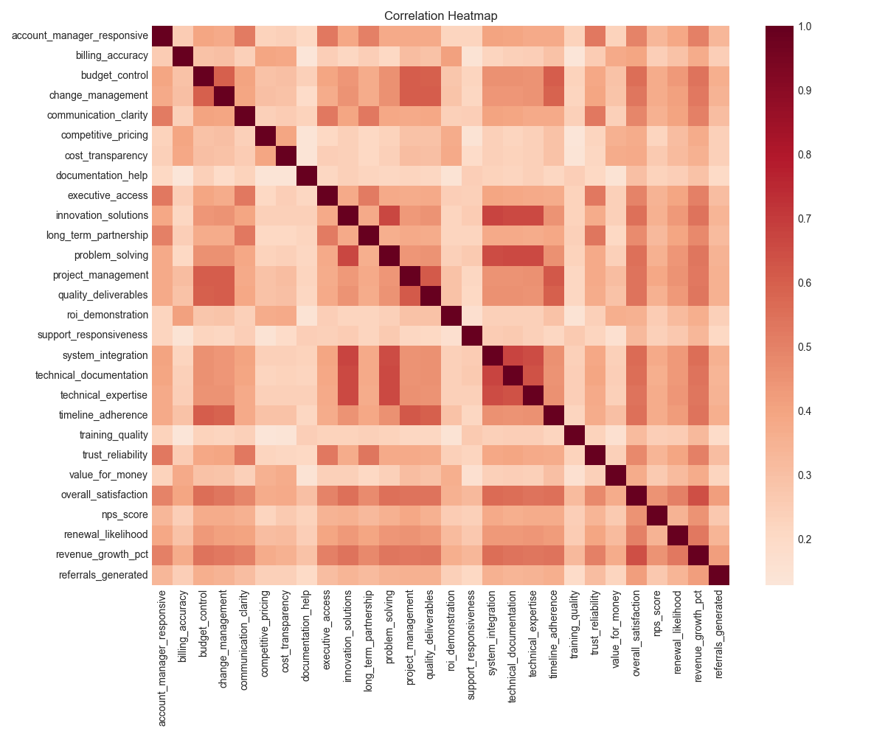
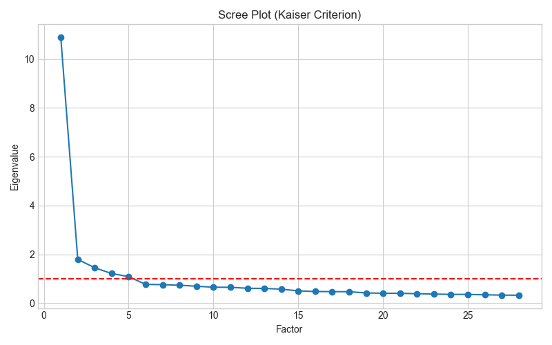
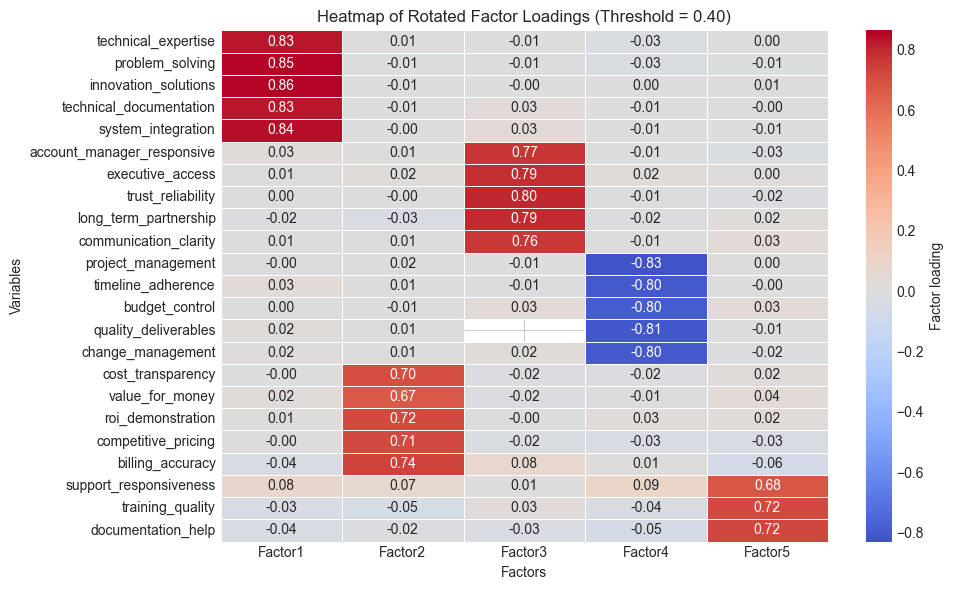

# Customer Satisfaction Factor Analysis

## Business Context
In today's competitive market, customer satisfaction is a key differentiator and a fundamental driver of growth. Understanding not only *what* satisfies customers, but *why* and *how* different service dimensions relate, is crucial for strategic decision-making. This project analyzes detailed survey data to identify the underlying factors driving loyalty and value perception.

## Client Description and Problem
The client is a technology services company seeking to optimize its customer retention strategy and improve its Net Promoter Score (NPS). The main problem is the difficulty in acting upon a large number of individual survey variables. The company needs to simplify these metrics into key "pillars" or factors to prioritize improvement initiatives and understand where to invest resources for maximum impact on overall satisfaction.

## Strategic Importance of the Analysis
This factor analysis allows for:
1.  **Simplification:** Reducing 23 complex variables to 5 manageable factors.
2.  **Prioritization:** Identifying which areas (technical, relationship, management, etc.) have the greatest weight on customer perception.
3.  **Actionability:** Designing specific strategies to improve each identified pillar, rather than trying to improve "everything at once".

## Methodology
The analysis was conducted using advanced statistical techniques in Python:
1.  **Data Preprocessing:** Cleaning and data quality verification (handling null values).
2.  **Exploratory Analysis:** Evaluating correlations between variables to identify initial patterns.
3.  **Adequacy Tests:** KMO (Kaiser-Meyer-Olkin) and Bartlett's Test of Sphericity to confirm the viability of factor analysis.
4.  **Factor Analysis:**
    *   Factor extraction using the Principal Axis Factoring method.
    *   Determination of the number of factors using the Scree Plot.
    *   Varimax rotation to improve factor interpretability, achieving a simple structure where each variable loads strongly on a single factor.

## Data
The dataset (`data/customer_satisfaction_data.csv`) contains survey responses evaluating various aspects of the service.
For a detailed description of each variable, please refer to the [DATA_DICTIONARY.md](DATA_DICTIONARY.md) file.

## Key Findings

### 1. Factor Structure
The analysis identified 5 latent factors that explain most of the variance in satisfaction data:

*   **Factor 1: Technical Excellence**
    *   Groups variables like *technical_expertise*, *problem_solving*, *innovation_solutions*.
    *   Represents core competence and engineering capability.

*   **Factor 2: Value & Pricing**
    *   Includes *cost_transparency*, *value_for_money*, *roi_demonstration*.
    *   Reflects economic perception and financial clarity.

*   **Factor 3: Relationship & Trust**
    *   Dominated by variables like *account_manager_responsive*, *trust_reliability*, *long_term_partnership*.
    *   Indicates the health of the commercial and human relationship.

*   **Factor 4: Project Management**
    *   Groups *project_management*, *timeline_adherence*, *budget_control*.
    *   Measures operational efficiency and promise fulfillment.

*   **Factor 5: Support & Service**
    *   Includes *support_responsiveness*, *training_quality*, *documentation_help*.
    *   Evaluates post-sales services and user enablement.

### 2. Key Visualizations

#### Correlation Heatmap
Shows strong relationships between variables within the same functional groups.

#### Scree Plot
Justifies the selection of 5 factors, where the curve "flattens", indicating diminishing returns when adding more factors.

#### Factor Loadings
Visualization of which variables contribute most to each identified factor.

## Business Recommendations
Based on the identified factors:

1.  **Strengthen Technical Excellence:** Since it is a dominant factor, maintaining high hiring and technical training standards is non-negotiable.
2.  **Review Pricing Strategy:** The "Value" factor is distinct from the technical one. Ensure total cost transparency to improve value perception, regardless of technical quality.
3.  **Proactive Account Management:** Invest in account managers who build long-term trust, as this forms a separate satisfaction pillar.
4.  **Standardize Project Management:** If scores in this factor are low, implement agile methodologies or rigorous PMI standards to ensure adherence to deadlines and budgets.

## Next Steps
1.  Calculate factor scores for each customer.
2.  Segment customers based on these 5 satisfaction profiles.
3.  Correlate "Factor Scores" with *NPS* and *Renewal Likelihood* to quantify the financial impact of each pillar.
